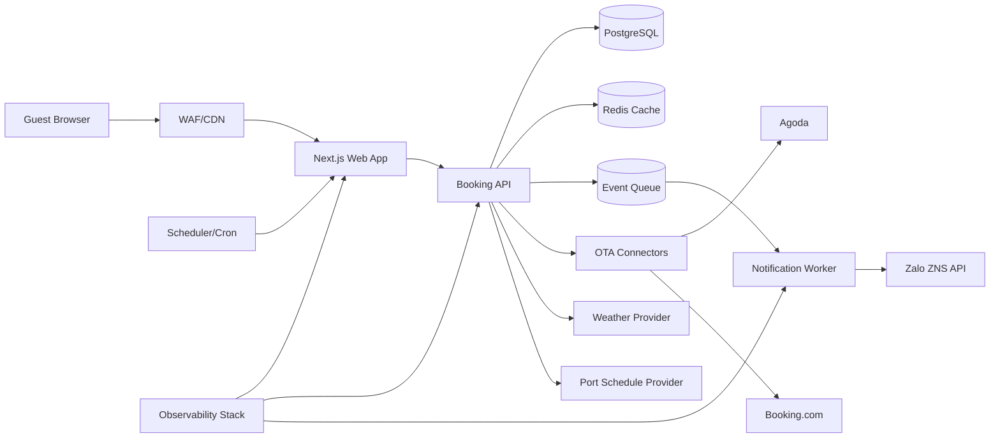

# System Architecture v1

## 1. Bối cảnh

Hệ thống phục vụ: giới thiệu homestay, đặt phòng trực tiếp, đồng bộ OTA, thông báo khách, và xử lý sự cố thời tiết/tàu.

## 2. Kiến trúc container (mức triển khai)

## 3. Trust boundaries

1. Internet boundary: `Guest Browser <-> WAF/CDN`
2. Application boundary: `Web/API/Worker` chỉ giao tiếp qua endpoint xác thực.
3. Data boundary: `DB/Cache/Queue` private network, không public.
4. Third-party boundary: Zalo/OTA/Weather/Port APIs có timeout + retry + circuit breaker.
5. Worker boundary: Scheduler chỉ được gọi endpoint dispatch nội bộ bằng token chuyên dụng.

## 4. Nguyên tắc thiết kế

1. API-first: UI chỉ gọi API contract có version.
2. Event-driven cho tác vụ chậm (thông báo, đồng bộ đối tác).
3. Strong consistency cho tồn phòng nội bộ; eventual consistency cho OTA sync.
4. Fail-safe UX: dữ liệu đối tác lỗi thì degrade có kiểm soát, không crash.

## 5. Luồng nghiệp vụ đặt phòng

1. Client gửi yêu cầu booking + consent.
2. API validate dữ liệu + kiểm tra idempotency key.
3. API mở transaction và tạo booking `PENDING_CONFIRMATION`.
4. Trong cùng transaction: ghi consent log + audit event + outbox event.
5. Commit transaction.
6. Worker đồng bộ OTA và gửi thông báo.
7. API/worker cập nhật trạng thái cuối cùng: `CONFIRMED` hoặc `FAILED`.

## 6. Non-functional targets

- Availability tháng: `99.9%` cho Booking API.
- P95 latency Booking API: `< 350ms` (không tính upstream đối tác).
- RTO/RPO theo [BCP_DR_PLAN](/Users/nguyenvietcuong/Documents/2026.BinhMinhHomestay/docs/ops/BCP_DR_PLAN.md).
